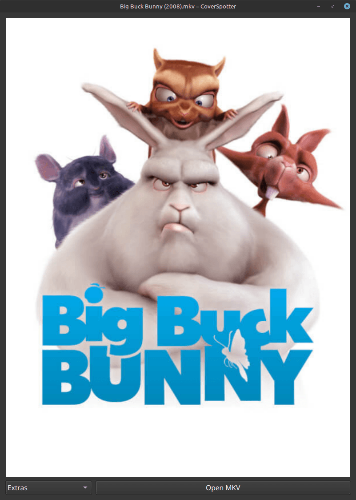
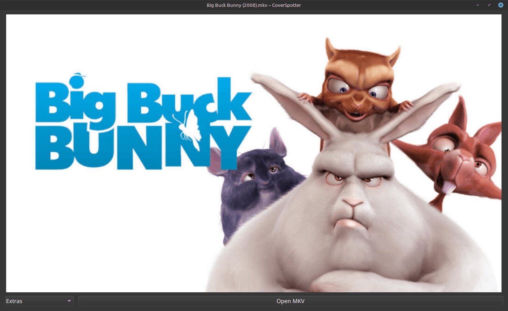

# CoverSpotter

Since I am not aware of any simple way in Linux to display the cover art embedded in an MKV video file (attachment "cover.jpg" or "cover_land.jpg"), I wrote this program specifically for this purpose. Simply select an MKV file (or drag and drop it onto CoverSpotter) and the cover will be displayed immediately.

## Features

- GUI-driven with convenient Drag & Drop support.
- Displays both portrait covers (cover.jpg) and landscape covers (cover_land.jpg).
- Read-only: MKV files are not modified in any way.

  

<figcaption><i>Figure 1: Cover in protrait mode</i></figcaption>
  

## Installation

The program is provided as an AppImage and does not require installation. In my tests, CoverSpotter works on Linux Mint, LMDE, and Cachy OS. I haven't been able to test other distributions yet, but they should work fine.

## Technology

CoverSpotter is written entirely in C++ and utilizes the Qt6 framework. Furthermore, it uses the "libavformat" and "libavutil" libraries from the FFmpeg project.

  

<figcaption><i>Figure 2: Cover in landscape mode</i></figcaption>
  

## License

Licensed under Creative Commons Attribution 4.0 International (CC BY 4.0). You are encouraged to share it with others.

## Credits

The movie cover shown in the screenshot is a modified version of the "Big Buck Bunny" poster - © copyright 2008, Blender Foundation | www.bigbuckbunny.org
Licensed under Creative Commons Attribution 3.0. https://creativecommons.org/licenses/by/3.0/deed.en
